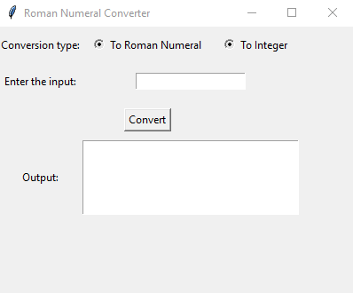

# Roman Numeral Converter

A Python program for converting integers to Roman numerals and vice versa.

## Installation

1. Clone the repository: `git clone https://github.com/your-username/roman-numeral-converter.git`
2. Install the required dependencies: `None`

## Usage

To use the program, run `python converter.py` in your terminal. This will launch the command-line version of the program.

Alternatively, you can run the GUI version of the program by running `python rngui.py` in your terminal. This will launch a graphical user interface (GUI) that allows you to enter input and view output.

### Example usage

#### Command-line version

$ python RomanNumerals.py
Enter a number or a Roman numeral: 123
The Roman numeral for 123 is CXXIII.

#### GUI version

$ python rngui.py

## Credits

This program was written by [Joe Bonfanti Jr](https://github.com/IAmJuniorB).

The Roman numeral conversion algorithm was adapted from [this post](https://www.geeksforgeeks.org/converting-decimal-number-lying-between-1-to-3999-to-roman-numerals/) on GeeksforGeeks.

The GUI was built using the [Tkinter](https://docs.python.org/3/library/tk.html) module in Python.

## License

This program is licensed under the [MIT License](LICENSE).
